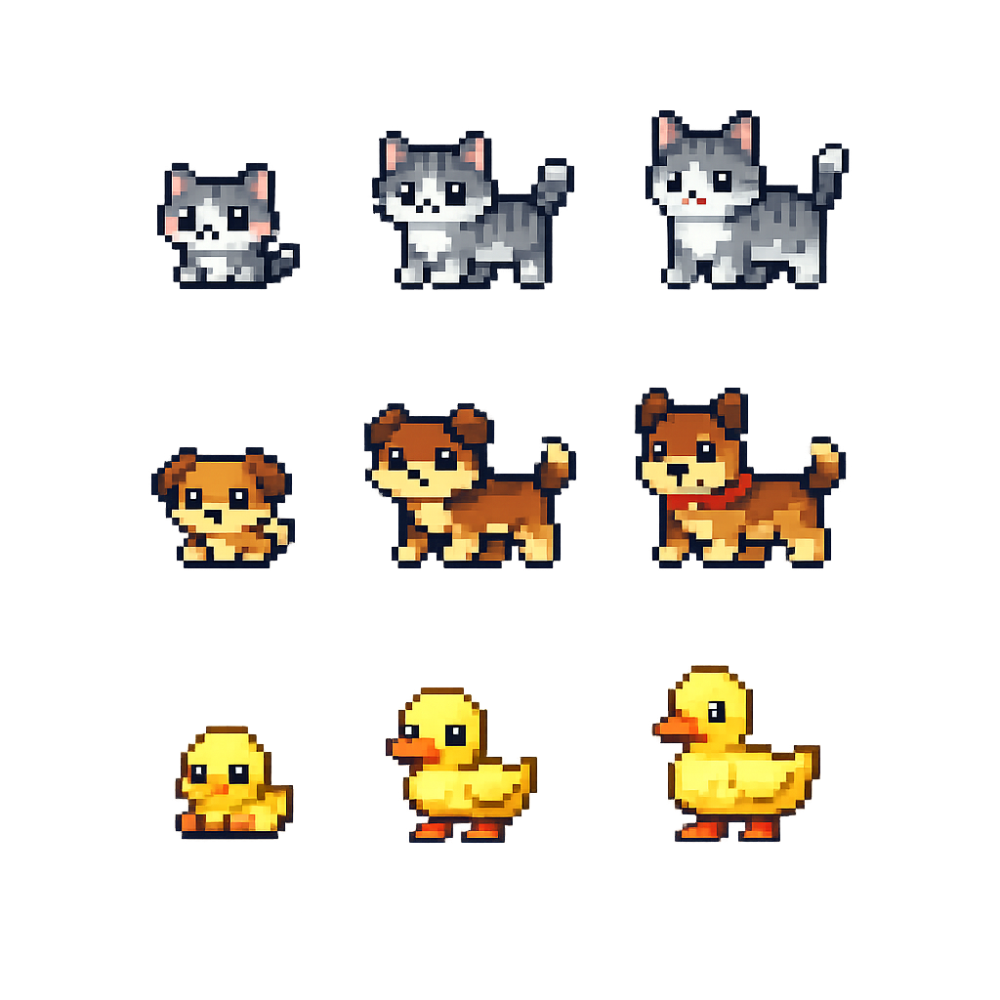
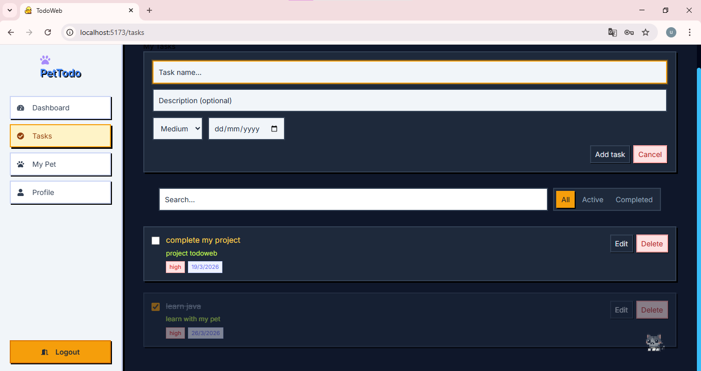
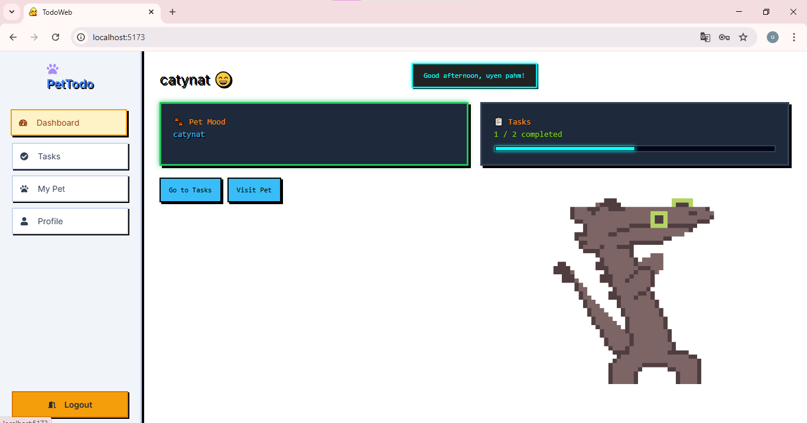
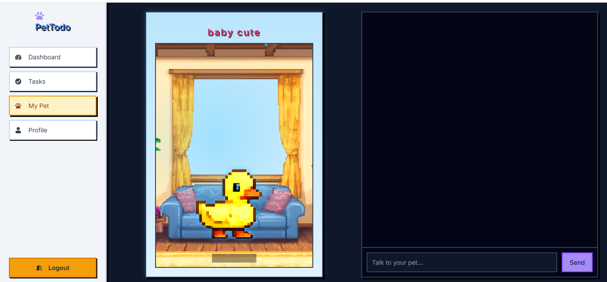
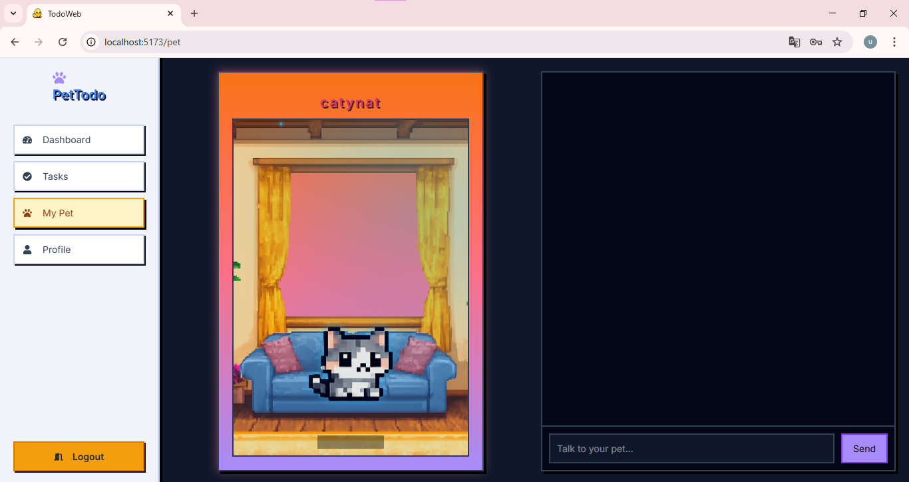
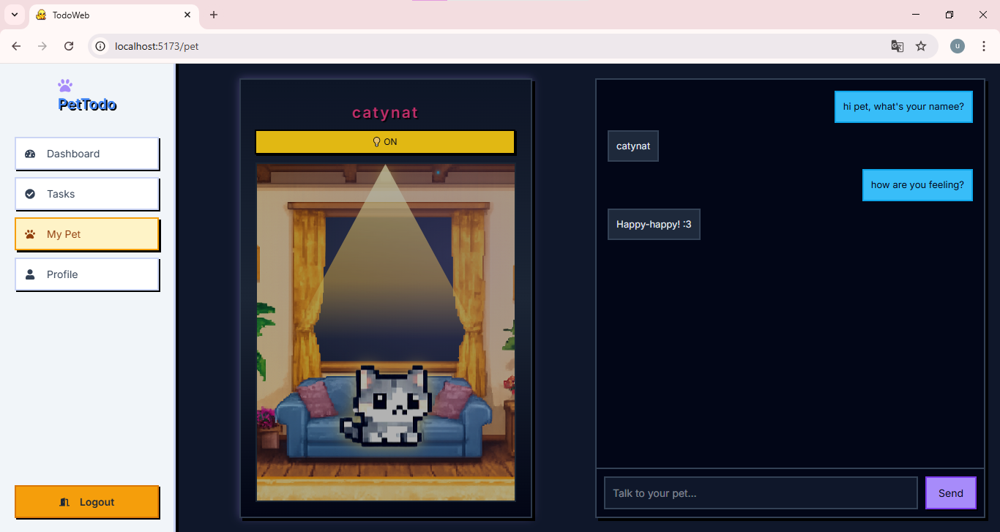
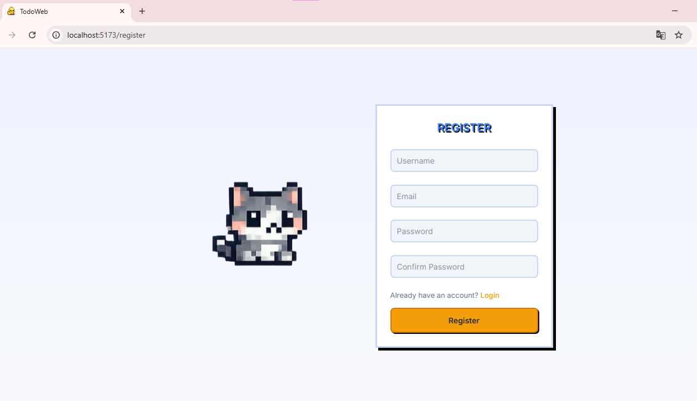

# 🐾 AI-Powered Pet Todo Web App

A full-stack **Todo App with an AI-driven virtual pet system**.  
Stay productive, interact with your smart pet, and let AI guide your daily habits 🧠🐶✨


## 🚀 Features

* ✅ Task management (create, update, complete)
* 🐾 Virtual pet that evolves based on your behavior
* 🧠 AI-powered task suggestions based on your habits
* 💬 AI pet chat (your pet can talk, motivate, and remind you)
* 📊 Smart productivity tracking & insights
* 🌗 Day / Night pet environment


## 🧠 AI Highlights

* ✨ **Smart Task Recommendation**  
  Suggests tasks based on your previous activity & patterns

* 💬 **Conversational AI Pet**  
  Your pet can:
  - Motivate you when you're inactive  
  - Celebrate your achievements  
  - Remind unfinished tasks  

* 📊 **Behavior Analysis**  
  Tracks:
  - Task completion consistency  
  - Active hours  
  - Productivity trends  

* 🔮 **Future: Predictive Productivity**  
  Predict your low-focus time and suggest better schedules


## 🖼️ Demo

### 🐾 Pet System




### 📋 Task Management




### 📊 Dashboard




### 🏠 Pet Room (Morning, Afternoon & Night)

**Morning**


**Afternoon**


**Night**



### 🔐 Authentication




## 🏗️ Project Structure

```
project-root/
├── todoweb_be/        # Spring Boot API
├── todoweb_fe/       # React App
├── docs/
│   └── images/     # Images used in README
└── README.md
```


## 🛠️ Tech Stack

### Frontend

* React JS
* Tailwind CSS
* Axios

### Backend

* Spring Boot
* MongoDB 

### AI Layer
* Google Gemini API integration (AI pet chat via prompt engineering)
* Dynamic prompt building based on pet state (name, mood, stage, tasks)
* Context-aware responses (task progress + user behavior)
* Lightweight behavior tracking using task completion data

## ⚙️ Setup

### 1. Clone repo

```bash
git clone <your-repo-url>
cd project-root
```

### 2. Run backend

```bash
cd backend
./mvnw spring-boot:run
```

### 3. Run frontend

```bash
cd frontend
npm install
npm start
```


## 💡 Idea

This project turns boring task management into a **fun and emotional experience** by:

* Giving users a virtual pet 🐕
* Rewarding productivity with pet growth 🌱
* Creating attachment & motivation ❤️


## 📌 Future Improvements

* 🎮 Mini games for pets
* 🛒 Pet customization (skins, accessories)
* ☁️ Deploy online (Vercel + Render)


## 👤 Author

Made with 💙 by phuyen27
